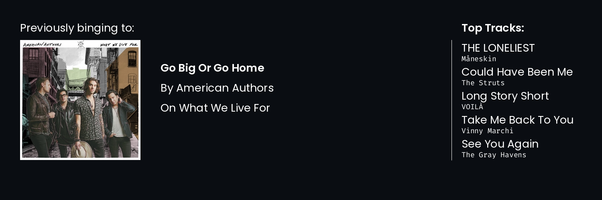

<!-- Display the assets/profile.png image as rounded -->
<p align="center" style="margin: 0; border-radius: 100px;">
    <image src="https://media.discordapp.net/attachments/796370670547632178/1058393082288156723/image1.png" height="auto" width="200" />
</p>

<h1 align="center">Hello everyone, I'm Rohith K Bobby! 👋</h1>

<h3 align="center">A Machine learning dev & student</h3>

### Here's to know me more

Hey y'all, My name is Rohith. 18 y/o developer from India, still consider myself new but always learning new things. I absolutely love to write code, and discuss code, and everything around code, haha. Got a knack for
programming, and building those cool ML models you've always dreamt of. Journey been a crazy one, went from
being scared by HTML to loving Machine learning in a single year, during the pandemic. The people I met on the way, the friendships made, lessons learned all this was a great adventure! 💙

### I absolutely love to do these

- **Sports 🏏** - I like playing cricket and badminton.
- **Music 🎵** - My favourite artists are American Authors, The Script, Avicii, Imagine dragons and OneRepublic.
- **Video Games 🎮** - Minecraft especially Hypixel Bedwars.

## Some of my best repos

[](https://github.com/Rohith04MVK/AI-Art-Generator) [](https://github.com/Rohith04MVK/Mini-Keras)

[](https://github.com/Rohith04MVK/Brain-Tumor-Segmentation-And-Classification) [](https://github.com/Rohith04MVK/Recolor)

## 🔧 My useful arsenal of tools

```rust
struct Arsenal {
    name: &str,
    languages: Vec<&str>,
    frameworks: Vec<&str>,
    others: Vec<&str>,
    socials: HashMap<&str, &str>,
}

fn main() {
    let rohith = Arsenal {
        name: "Rohith K bobby",
        languages: vec!["Python", "Rust", "C++"],
        frameworks: vec![
            "Flask", "FastAPI", "Pandas", "Numpy", "Tensorflow", "Pytorch"
        ],
        others: vec!["Git", "Github", "Spotify", "Arch"],
        socials: {
            let mut map = HashMap::new();
            map.insert("Discord", "RohitK#7175");
            map.insert("Reddit", "Sudo_Python");
            map
        },
    };
}
```

## 📌 My Github Stats

<p align=center>
     
</p>

<p align=center>
    
</p>

<p align=center>
    
</p>
