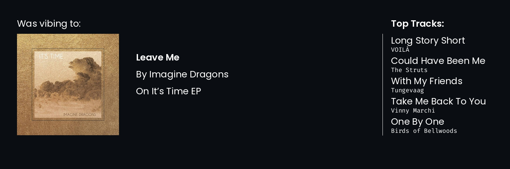

<!-- Display the assets/profile.png image as rounded -->
<p align="center" style="margin: 0; border-radius: 100px;">
    <image src="https://i.pinimg.com/736x/02/58/cb/0258cbb9ea0177551aed28c64716d5d4.jpg" height="auto" width="200" />
</p>

<h1 align="center">Hello everyone, I'm Rohith K Bobby! 👋</h1>

<h3 align="center">A Machine learning dev & student</h3>

### Here's to know me more

Hey there, I'm Rohith, a passionate developer who loves to write and discuss code. I'm always excited to learn new things and develop my skills, especially when it comes to building amazing machine learning models. My coding journey has been an incredible adventure, going from being intimidated by HTML to falling in love with the world of AI and ML. Along the way, I've met inspiring people, made lifelong friendships, and learned valuable lessons that have helped me grow as a developer. I'm always looking for new opportunities to create and innovate, so feel free to check out my work and connect with me!

### I absolutely love to do these

- **Sports 🏏** - I like playing cricket and badminton.
- **Music 🎵** - My favourite artists are American Authors, The Script, Avicii, Imagine dragons and OneRepublic.
- **Video Games 🎮** - Minecraft especially Hypixel Bedwars.

## Some of my best repos

[](https://github.com/Rohith04MVK/AI-Art-Generator) [](https://github.com/Rohith04MVK/Mini-Keras)

[](https://github.com/Rohith04MVK/Brain-Tumor-Segmentation-And-Classification) [](https://github.com/Rohith04MVK/Recolor)

## 🔧 My useful arsenal of tools

```rust
struct Arsenal {
    name: &str,
    languages: Vec<&str>,
    frameworks: Vec<&str>,
    others: Vec<&str>,
    socials: HashMap<&str, &str>,
}

fn main() {
    let rohith = Arsenal {
        name: "Rohith K bobby",
        languages: vec!["Python", "Rust", "C++"],
        frameworks: vec![
            "Flask", "FastAPI", "Pandas", "Numpy", "Tensorflow", "Pytorch"
        ],
        others: vec!["Git", "Github", "Spotify", "Arch"],
        socials: {
            let mut map = HashMap::new();
            map.insert("Discord", "RohitK#7175");
            map.insert("Reddit", "Sudo_Python");
            map
        },
    };
}
```

## 📌 My Github Stats

<p align=center>
     
</p>

<p align=center>
    
</p>

<p align=center>
    
</p>
